# Alex.bbq

A self-hosted BBQ temperature dashboard for the [Maverick ET-732](https://www.maverickthermometers.com/) wireless thermometer. The app runs on a Raspberry Pi, reads probe temperatures over GPIO, and presents live charts, cook history, and push alerts in the browser.

Built with **Laravel 13**, **Livewire 4**, **Filament 5**, and **Livewire Flux**.

---

## Table of contents

- [Overview](#overview)
- [Screenshots](#screenshots)
- [Features](#features)
- [Architecture](#architecture)
- [Requirements](#requirements)
- [Installation](#installation)
  - [Quick setup (local dev)](#quick-setup-local-dev)
  - [Local development (Laravel Herd)](#local-development-laravel-herd)
  - [Create an admin user](#create-an-admin-user)
  - [Push notifications](#push-notifications)
- [Configuration](#configuration)
- [Development](#development)
- [Production (Raspberry Pi)](#production-raspberry-pi)
- [Artisan commands](#artisan-commands)
- [Testing](#testing)
- [License](#license)

---

## Overview

Alex.bbq intercepts transmissions from a Maverick ET-732 BBQ thermometer using a radio frequency chip connected to a Raspberry Pi via GPIO. A small C daemon (`maverick`) decodes the wireless signal and writes 
temperature readings to SQLite. The Laravel app displays those readings in real time, stores completed cooks, and can notify you when probe temperatures drift outside your thresholds. The home page shows the active 
cook (or the most recent finished cook) with an interactive temperature chart. Authenticated users can start and stop cooks, manage smokers, configure alerts, and edit past cook details.

---

## Screenshots

Captured from a local install with seeded data (`admin@admin.com` / `password`). Regenerate with `npm run screenshots` (requires [Playwright](https://playwright.dev/) Chromium; set `APP_URL` if not using Laravel Herd).

### Dashboard

The home page shows the active cook when one is running; otherwise it displays the most recent finished cook with chart, legend, and cook notes below the chart card.

| Desktop | Mobile |
|---------|--------|
| 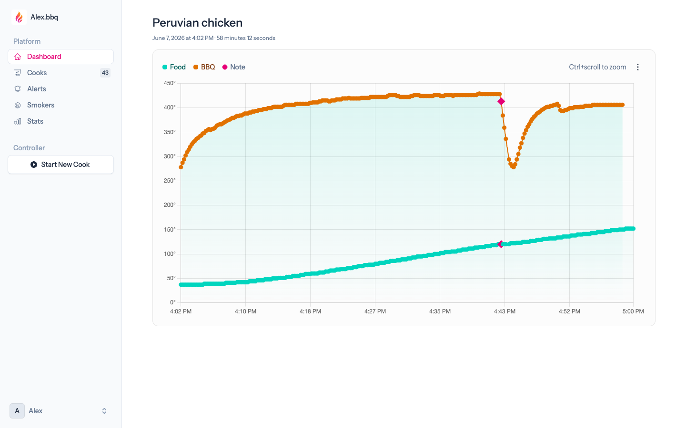 | 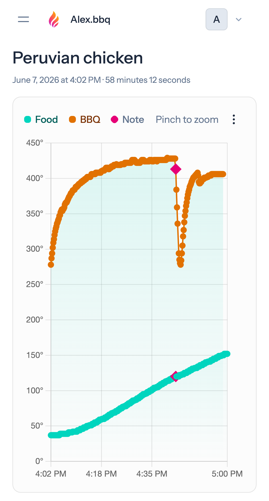 |

### Login

Email/password and passkey sign-in.

| Desktop | Mobile |
|---------|--------|
| 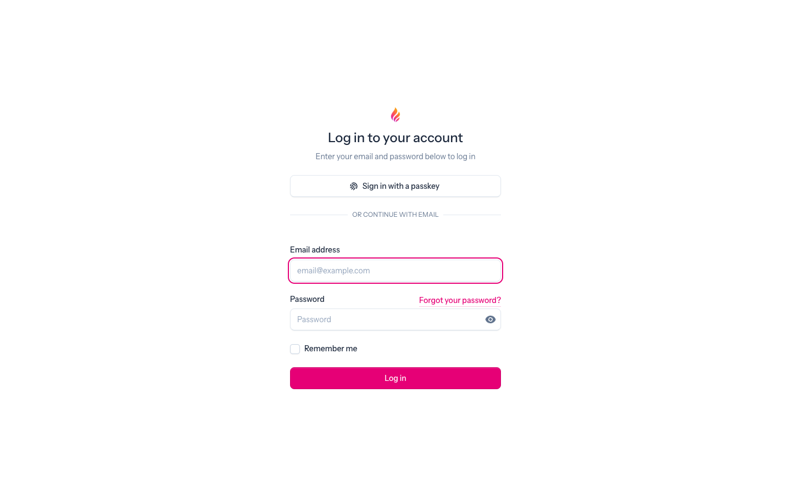 | 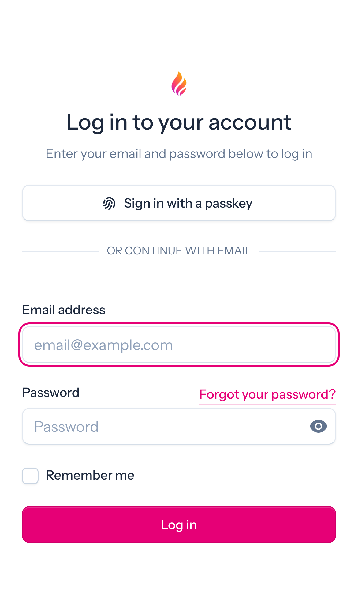 |

### Cook history

Browse finished cooks with date, duration, and description preview.

| Desktop | Mobile |
|---------|--------|
| 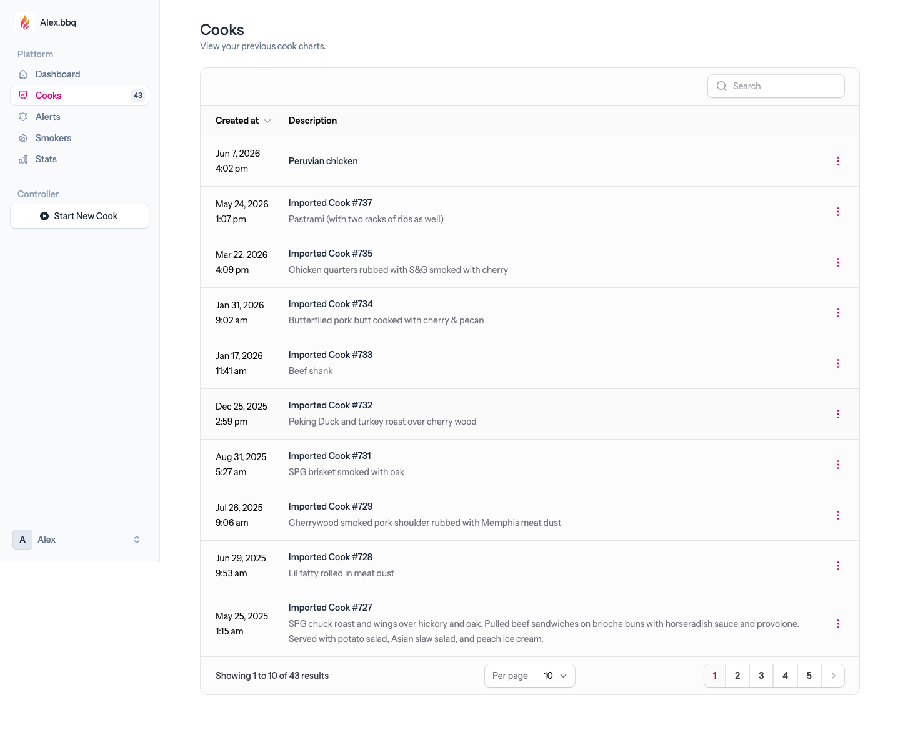 | 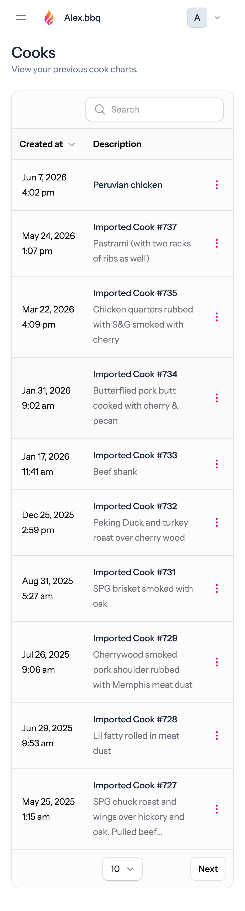 |

### Cook page

Full chart for a finished cook. Owners can edit readings and notes from the chart (⋮ menu → **Edit Details**).

| Desktop | Mobile |
|---------|--------|
| 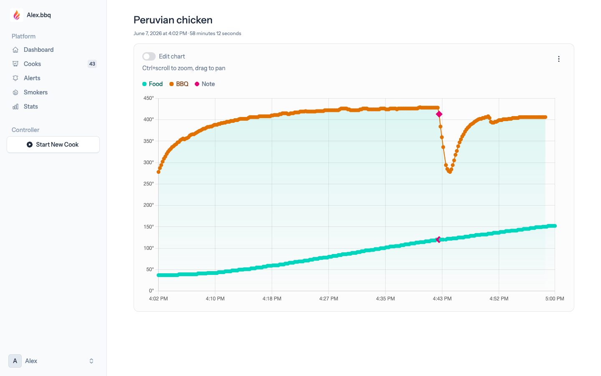 | 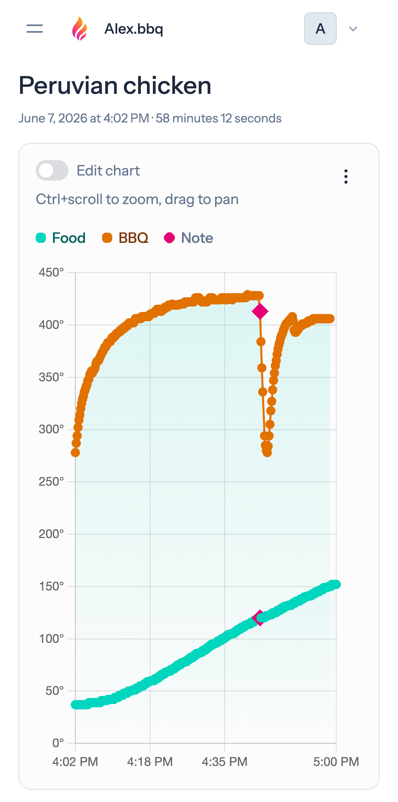 |

### Statistics

Aggregate cook count, total cook time, and reading totals.

| Desktop | Mobile |
|---------|--------|
| 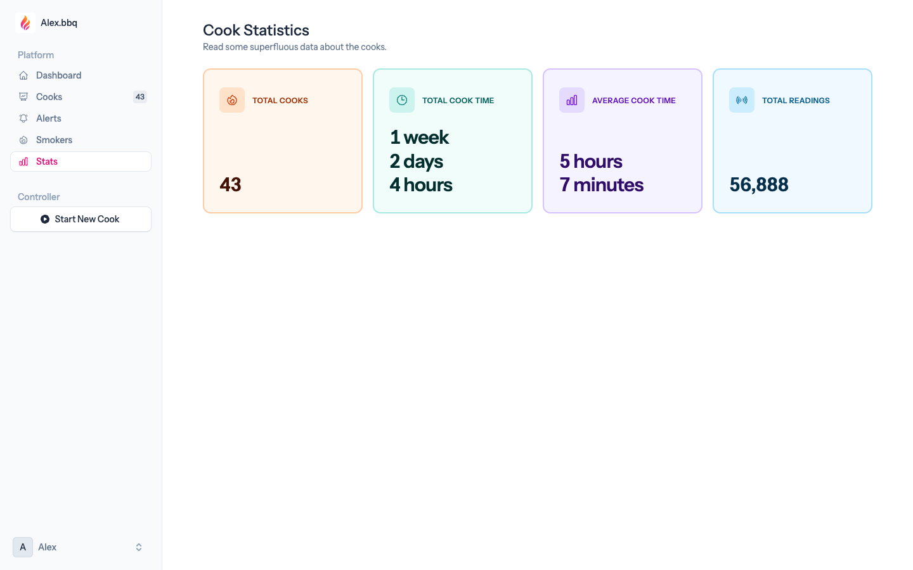 | 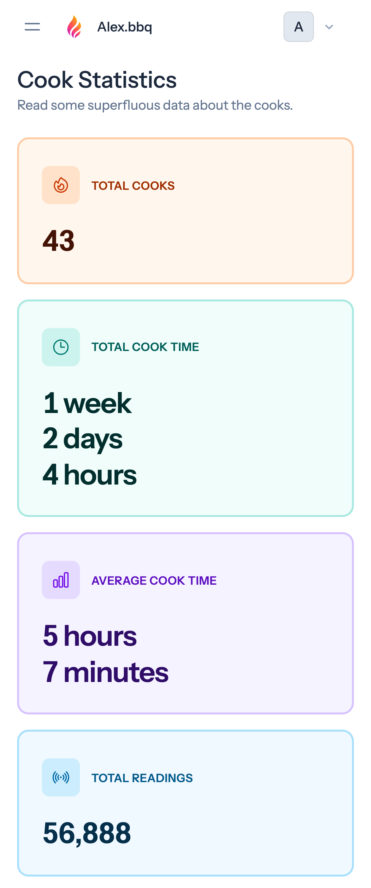 |

### Alerts

Configure food and BBQ probe temperature thresholds and notification cooldown.

| Desktop | Mobile |
|---------|--------|
| 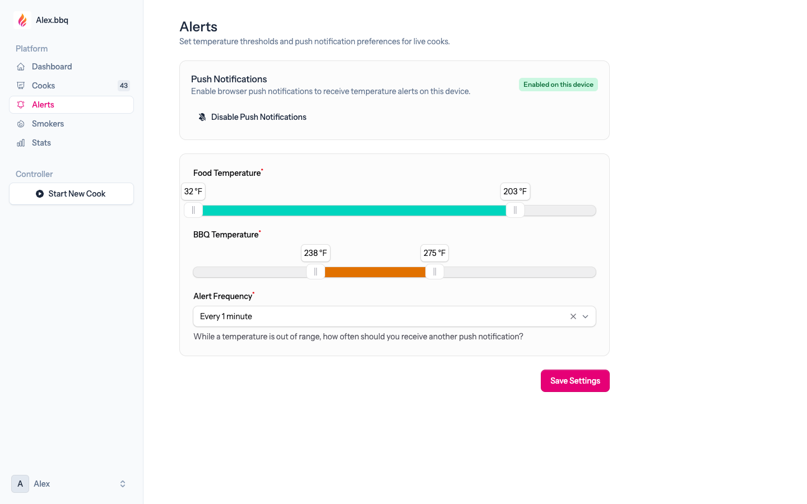 | 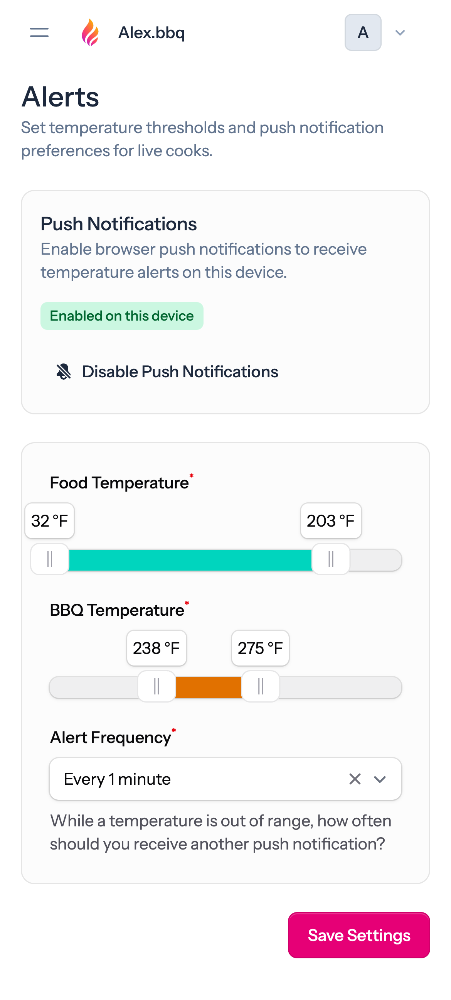 |

### Smokers

Manage smoker names used when starting cooks.

| Desktop | Mobile |
|---------|--------|
| 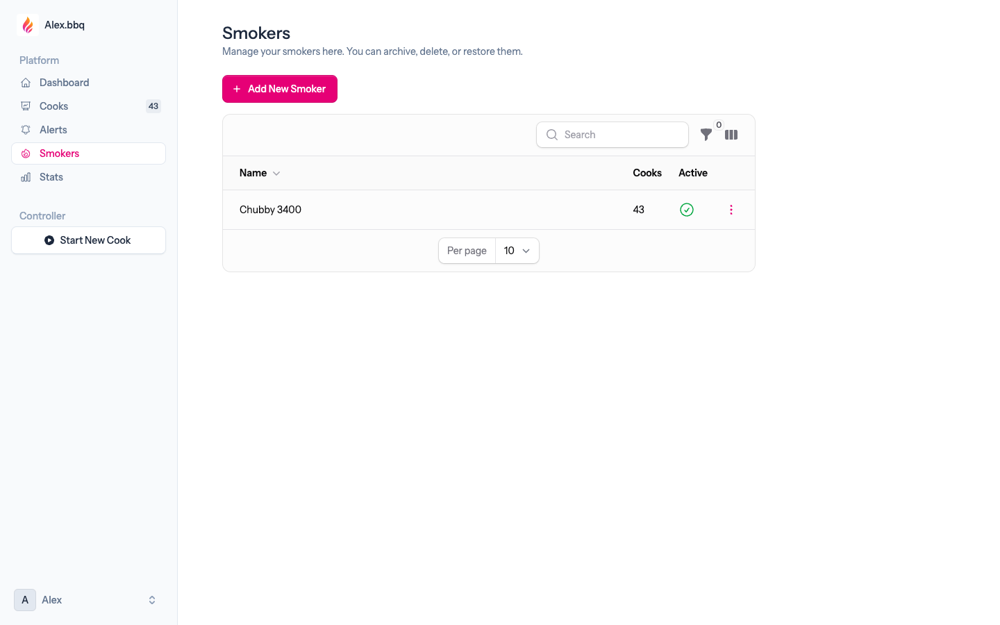 | 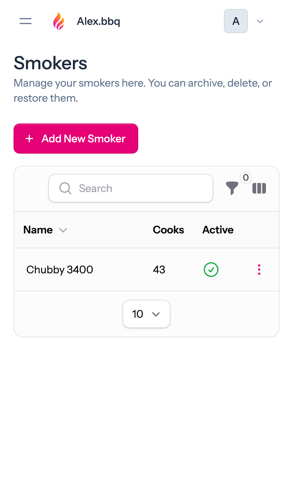 |

---

## Features

### Live monitoring

- **Real-time temperature chart** — Food and BBQ probe readings plotted over time with Chart.js.
- **WebSocket updates** — Live cooks refresh automatically via [Laravel Reverb](https://laravel.com/docs/reverb) and Laravel Echo.
- **Live cook timer** — Elapsed time since the first reading for in-progress cooks.
- **Start / stop recording** — Start a new cook from the dashboard; stopping finalizes the cook and ends probe recording.
- **Cook Simulator** – Simulate cooking with realistic generated probe readings for testing on your computer.

### Cook management

- **Cook history** — Browse finished cooks with date, title, and description preview.
- **Cook descriptions** — Write detailed notes with stylized text, lists, links, and image gallery attached to each cook.
- **Individual cook pages** — Share the full chart, duration, and description (with image gallery) for any finished cook.
- **Smoker tracking** — Associate cooks with named smokers; archive or restore smokers as needed.

### Interactive charts

- **Pinch / scroll zoom** — Explore finished cooks on mobile (pinch) or desktop (Ctrl+scroll); reset zoom returns to the full timeline.
- **Finished cook editing** — Delete individual readings, ranges of points, or add notes to specific timestamps (owner only).
- **Desktop & mobile accessible** — Edit chart points on any device.
- **Touch-friendly selection** — Drag to select a range of points on mobile.

### Alerts & notifications

- **Temperature thresholds** — Set min/max ranges for food and BBQ probes.
- **Alert frequency** — Configurable cooldown (1, 3, 5, 10, or 15 minutes) to avoid notification spam.
- **Web push notifications** — Browser push alerts when temperatures go out of range during a live cook.

### Authentication & security

- **Email + password login** — Laravel Fortify.
- **Passkeys (WebAuthn)** — Passwordless sign-in support.
- **Password reset** — Standard forgot-password flow.
- **Profile & appearance settings** — Update account details and theme preferences.

### Progressive Web App

- Installable as a standalone app for quick access from phone, tablet or desktop while tending the smoker.

### Statistics

- **Total cook time** — Aggregate duration across all recorded cooks (`/stats`).

---

## Architecture

```
┌─────────────────┐ 433MHz RF chip ┌──────────────────┐
│ Maverick ET-732 │ ─────────────► │     maverick     │  (C daemon, pigpio)
│   transmitter   │                └────────┬─────────┘
└─────────────────┘                         │ writes readings
                                            ▼
                                   ┌──────────────────┐
                                   │  SQLite database │
                                   └────────┬─────────┘
                                            │
                                            ▼
                                   ┌──────────────────┐
                                   │  Laravel app     │  Livewire + Filament UI
                                   └────────┬─────────┘
                                            │ WebSockets
                                            ▼
                                   ┌──────────────────┐
                                   │  Laravel Reverb  │  live chart updates
                                   └────────┬─────────┘
                                            │
                                            ▼
                                   ┌──────────────────┐
                                   │  Browser / PWA   │
                                   └──────────────────┘
```

| Component | Role |
|-----------|------|
| `maverick.c` | Reads GPIO pin 15, decodes ET-732 RF packets, inserts readings via Artisan |
| `maverick.sh` | Start/stop/status wrapper for the daemon (uses `sudo` on the Pi) |
| `maverick-fake.sh` | Local dev substitute — runs `php artisan maverick:simulate` instead of hardware |
| `MaverickService` | PHP interface to start/stop the daemon and finalize active cooks |
| `LiveCookBroadcast` | Pushes chart update events over Reverb |
| `TemperatureAlertService` | Evaluates probe readings and sends web push notifications |

---

## Requirements

### Application

| Dependency | Version |
|------------|---------|
| PHP | ^8.3 |
| Composer | 2.x |
| Node.js | 20+ (22 recommended; for Vite asset build) |
| SQLite | 3.x (default database) |

### Local development

- [Laravel Herd](https://herd.laravel.com/) (recommended) or any PHP 8.3+ environment with a web server

### Production (Raspberry Pi)

- Fresh [Raspberry Pi OS](https://www.raspberrypi.com/software/) — **nothing preinstalled** (PHP, Composer, Caddy, pigpio installed by `install-pi-production.sh`)
- Pi with GPIO (BCM pin 15); tested on Pi Zero W (ARMv6)
- Cloudflare: API token (Zone → DNS → Edit), zone ID, domain A record
- No Node.js — assets in `public/build/`

## Installation

### Quick setup (local dev)

> **Raspberry Pi?** Skip this section — use [Production (Raspberry Pi)](#production-raspberry-pi) instead.

From the project root on your Mac or PC:

```bash
composer setup
```

This runs, in order:

1. `composer install`
2. Copies `.env.example` → `.env` (if missing)
3. Creates `database/database.sqlite` (if missing)
4. `php artisan key:generate`
5. `php artisan reverb:configure --local` — generates `REVERB_APP_*` credentials and confirms local WebSocket defaults
6. `php artisan webpush:configure` — generates `VAPID_*` keys for browser push notifications
7. `php artisan migrate --force`
8. `npm install`
9. `npm run build`

The defaults in `.env.example` target `php artisan serve` at `http://127.0.0.1:8000` with Reverb on port `8080`. No Herd or other hosting is required.

Seed the default admin account (optional but recommended for first login):

```bash
php artisan db:seed
```

Then start the development environment:

```bash
composer dev
```

This launches four processes concurrently:

- `php artisan serve` — web server at `http://127.0.0.1:8000`
- `php artisan reverb:start` — WebSocket server for live chart updates
- `php artisan pail` — log tail
- `npm run dev` — Vite hot reload

Open **http://127.0.0.1:8000** (or `http://localhost:8000` — both origins are allowed in local dev).

If you have Laravel Herd installed but are using `php artisan serve`, keep `APP_URL=http://127.0.0.1:8000` in `.env`. Vite only enables Herd TLS when `APP_URL` uses a `*.test` host.

### Local development (`php artisan serve`)

If you are not using [Laravel Herd](#local-development-laravel-herd), the defaults in `.env.example` are already set for:

```bash
php artisan serve              # http://127.0.0.1:8000
php artisan reverb:start --port=8080
```

Ensure your `.env` matches the URL you open in the browser (origin checks use `APP_URL`):

```env
APP_URL=http://127.0.0.1:8000
REVERB_HOST=127.0.0.1
REVERB_PORT=8080
REVERB_SCHEME=http
```

Browsing at `http://localhost:8000` while `APP_URL` uses `127.0.0.1` works out of the box in local dev; Reverb allows both origins automatically.

**Common symptoms when these do not match:**

- Browser DevTools shows a WebSocket attempt, but Reverb logs no connections (wrong port/scheme or rejected origin).
- Fake cook readings appear in the database but the chart does not update (Laravel is broadcasting to the wrong host/port — check `storage/logs/laravel.log` for “Live cook broadcast failed”).

Restart `php artisan serve` and `php artisan reverb:start` after changing `.env`.

If you already ran `composer setup` with an older `.env.example`, repair local defaults without rotating credentials:

```bash
php artisan reverb:configure --local
```

Then restart `php artisan serve` and `php artisan reverb:start`.

**Verify the full pipeline:**

1. Fake maverick is running — `storage/logs/maverick-fake.log` should log new readings every ~12 seconds after starting a cook.
2. Laravel is broadcasting — when a reading is logged, Reverb’s terminal should show activity on the `cooks` channel. If not, check `storage/logs/laravel.log` for `Live cook broadcast failed`.
3. The browser is subscribed — DevTools → Network → WS → Frames should show `LiveCookUpdated` events with `"type":"reading"`. The `data` field is a JSON **string**; the frontend parses it before refreshing the chart. A WS status of `101` only means the socket connected, not that events are flowing.

If readings appear in `storage/logs/maverick-fake.log` and WS frames show `LiveCookUpdated` but the chart stays frozen, rebuild frontend assets so the broadcast handler includes the JSON parse fix:

```bash
npm run build
```

Hard-refresh the browser (or unregister the service worker once) after rebuilding.

### Local development (Laravel Herd)

1. Clone the repository into your Herd sites directory (e.g. `~/Herd/alexbbq`).
2. Run `composer setup` and `php artisan db:seed`.
3. Open `https://alexbbq.test` (or your Herd domain).
4. In local mode (`APP_ENV=local`), the app automatically uses `maverick-fake.sh`, which simulates probe readings — no Raspberry Pi required.

**Reverb (live WebSocket updates):**

Set client connection settings in `.env` (see `.env.example` for the full local example). Application credentials are generated by `composer setup`:

```env
APP_URL=https://alexbbq.test
REVERB_HOST=alexbbq.test
REVERB_PORT=8080
REVERB_SCHEME=https
```

Then start Reverb:

```bash
php artisan reverb:start --port=8080
```

Reverb connection settings are injected at runtime (no `VITE_REVERB_*` build variables needed).

### Create an admin user

Seed a default account:

```bash
php artisan db:seed
```

| Field | Value |
|-------|-------|
| Email | `admin@admin.com` |
| Password | `password` |

Change the password after first login. Registration is disabled — this is intended as a single-user or small household deployment.

### Push notifications

`composer setup` generates `VAPID_PUBLIC_KEY` and `VAPID_PRIVATE_KEY` automatically (`webpush:configure`). Ensure `VAPID_SUBJECT="${APP_URL}"` is set in `.env` (default in `.env.example`).

To rotate keys manually:

```bash
php artisan webpush:configure --force
```

Use `--show` to print keys without writing them. The package also ships `webpush:vapid` if you prefer that command.

Enable push notifications from **Alerts** in the app after signing in.

---

## Configuration

Key environment variables (see `.env.example` for the full list):

| Variable | Description |
|----------|-------------|
| `APP_URL` | Public URL of the app (required for passkeys and push) |
| `APP_TIMEZONE` | Display timezone for cook timestamps (default: `America/New_York`) |
| `DB_CONNECTION` | Database driver (default: `sqlite`) |
| `BROADCAST_CONNECTION` | Set to `reverb` for live updates |
| `REVERB_APP_*` | Reverb application ID, key, and secret (required for live updates) |
| `REVERB_HOST`, `REVERB_PORT`, `REVERB_SCHEME` | Browser WebSocket connection (public URL; port `443` on Pi behind Caddy) |
| `REVERB_ALLOWED_ORIGINS` | Comma-separated hostnames for WebSocket Origin checks (defaults to `APP_URL` host; full URLs are normalized) |
| `REVERB_SERVER_*` | Server-side Reverb process (default `127.0.0.1:8080` over HTTP; Pi sets `8081` for Caddy) |
| `VAPID_*` | Web push notification keys |
| `MAVERICK_SCRIPT` | Override path to start/stop script |
| `MAVERICK_BINARY` | Path to the compiled `maverick` binary (default: project root) |
| `MAVERICK_USE_SUDO` | Whether `maverick.sh` runs via `sudo` (default: `true` on Pi, `false` for fake) |
| `MAVERICK_PHP` | PHP CLI binary for `maverick-fake.sh` / `maverick-artisan.sh` when auto-detection fails |
| `MAVERICK_FAKE_INTERVAL` | Seconds between simulated readings (default: `12`) |
| `MAVERICK_FAKE_BBQ_TARGET` | Simulated pit temperature target °F (default: `225`) |
| `PWA_*` | PWA manifest overrides (`PWA_DESCRIPTION`, `PWA_THEME_COLOR`, `PWA_SHORT_NAME`, etc.; see `config/pwa.php`) |
| `CLOUDFLARE_*` | Used by `cloudflare-ddns.sh` for dynamic DNS on the Pi |

---

## Development

### Fake Maverick simulator

When `APP_ENV=local`, starting a cook automatically launches the fake maverick daemon (`maverick-fake.sh`). You do not need to run the simulator manually during normal development.

For debugging only:

```bash
php artisan maverick:simulate
```

Or via the wrapper script:

```bash
./maverick-fake.sh start   # background
./maverick-fake.sh status
./maverick-fake.sh stop
```

### Linting

```bash
composer lint        # fix style with Laravel Pint
composer lint:check  # check only
```

### Building assets

```bash
npm run dev    # development with HMR
npm run build  # production build
```

### README screenshots

Requires a running app with seeded data and Playwright Chromium:

```bash
npx playwright install chromium   # first time only
APP_URL=https://alexbbq.test npm run screenshots
```

Optional env vars: `SCREENSHOT_EMAIL`, `SCREENSHOT_PASSWORD`, `SCREENSHOT_COOK_ID` (defaults: `admin@admin.com`, `password`, and a finished cook id from your database).

---

## Production (Raspberry Pi)

Tested on Pi Zero W (ARMv6). Assumes a **fresh Raspberry Pi OS** SD card — nothing else preinstalled.

`install-pi-production.sh` installs via apt: **PHP 8.4** (+ extensions), **Composer**, **pigpio**, **gcc/make**, **jq**, **sqlite3**, **Caddy** (ARMv6 + Cloudflare DNS), then configures Laravel, Reverb, Maverick, permissions, and DDNS. No Node.js.

### Fresh install

**You need:** Pi OS, network/SSH, Cloudflare credentials (hostname, API token, zone ID, A record).

**You do not need:** PHP, Composer, Caddy, pigpio, or any other libraries installed beforehand.

```bash
sudo apt update && sudo apt install -y git   # git only — to clone the repo
sudo git clone https://github.com/produktive/alexbbq.git /var/www/alexbbq
cd /var/www/alexbbq && sudo chown -R pi:www-data . && chmod +x deploy/*.sh

sudo DOMAIN=bbq.example.com \
     CLOUDFLARE_API_TOKEN=your-token \
     CLOUDFLARE_ZONE_ID=your-zone-id \
     ./deploy/install-pi-production.sh
```

Prompts for anything omitted. `SKIP_DDNS=1` if your IP is static. Login: `admin@admin.com` / `password`.

**Verify:** `sudo systemctl status caddy php8.4-fpm reverb` · `./deploy/verify-reverb.sh` · `curl -I https://bbq.example.com`

**Pi Zero W — avoid:** `composer setup`, `npm`, [Cloudsmith Caddy apt](https://caddyserver.com/docs/install#debian-ubuntu-raspbian), `caddy add-package` (ARMv7 crash), manual `caddy start` (use `systemctl`). Ensure port 80 is free (disable Apache / move Pi-hole web UI).

| Problem | Fix |
|---------|-----|
| Caddy `Illegal instruction` | `sudo ./deploy/install-caddy-armv6.sh` |
| Caddy `API token '' invalid` | Token must be in `/etc/systemd/system/caddy.service.d/cloudflare.conf`, not just `.env` |
| Port 80 in use | `sudo systemctl disable --now apache2` |
| SQLite readonly / disk I/O error | Remove `database/database.sqlite*` and rerun installer; check `dmesg` for SD card errors |

Validate Caddy (CLI does not read systemd env): `sudo CLOUDFLARE_API_TOKEN=your-token caddy validate --config /etc/caddy/Caddyfile`

### Manual install

For partial installs or recovery — same result as the automated script:

```bash
# 1. System + app
sudo apt install -y git curl wget jq php8.4-{cli,fpm,curl,intl,xml,mbstring,sqlite3,bcmath,zip,gd} \
  pigpio libpigpio-dev libsqlite3-dev gcc make sqlite3
# Install Composer if needed: https://getcomposer.org/download/
cd /var/www/alexbbq && composer install --no-dev --optimize-autoloader
cp .env.example .env && touch database/database.sqlite
php artisan key:generate && php artisan reverb:configure && php artisan webpush:configure
php artisan migrate --force && php artisan db:seed
# Set production .env values (see .env.example), then: php artisan config:cache
sudo chown -R pi:www-data storage bootstrap/cache database && sudo chmod -R ug+rwx storage bootstrap/cache database

# 2. Services (run as root from project root)
sudo ./deploy/install-caddy-armv6.sh
sudo mkdir -p /etc/systemd/system/caddy.service.d
sudo cp deploy/systemd/caddy.service.d/cloudflare.conf.example /etc/systemd/system/caddy.service.d/cloudflare.conf
# Edit token in cloudflare.conf; copy/adapt deploy/caddy/Caddyfile.example → /etc/caddy/Caddyfile
sudo ./deploy/install-reverb-service.sh
sudo ./deploy/install-cloudflare-ddns.sh   # optional; or SKIP with manual setup
gcc -o maverick maverick.c -lpigpio -lsqlite3 -lrt -pthread
sudo cp deploy/sudoers/maverick.example /etc/sudoers.d/alexbbq-maverick && sudo chmod 440 /etc/sudoers.d/alexbbq-maverick
sudo systemctl restart caddy php8.4-fpm
```

Individual scripts: `deploy/install-{pi-production,caddy-armv6,cloudflare-ddns,reverb-service}.sh` · `deploy/verify-reverb.sh`

| Script | Purpose |
|--------|---------|
| `install-pi-production.sh` | Full fresh-Pi install |
| `install-caddy-armv6.sh` | Caddy ARMv6 + Cloudflare DNS plugin |
| `install-cloudflare-ddns.sh` | DDNS cron + `.env` values |
| `install-reverb-service.sh` | Reverb systemd unit |
| `verify-reverb.sh` | Check Reverb + Caddy proxy |

---

## Artisan commands

| Command | Description |
|---------|-------------|
| `reverb:configure` | Generate `REVERB_APP_*` credentials in `.env` when empty |
| `webpush:configure` | Generate `VAPID_*` keys in `.env` when empty (included in `composer setup`) |
| `maverick:simulate` | Generate fake probe readings (local dev) |
| `app:import-legacy-data` | Import data from Alex.bbq v1 SQLite database |
| `cook:sync-ended-at` | Backfill `ended_at` timestamps from reading data |
| `cook:evaluate-alerts` | Manually evaluate temperature alerts for a reading |
| `alerts:diagnose` | Check alert configuration and VAPID setup |
| `app:normalize-cook-descriptions` | Convert legacy cook descriptions to RichEditor HTML |
| `app:normalize-legacy-reading-times` | Convert legacy local timestamps to UTC |
| `app:prune-cook-description-images` | Remove orphaned cook description image files |
| `webpush:vapid` | Generate VAPID keys for push notifications |

---

## Testing

```bash
composer test   # Pint check + Pest feature tests
npm test        # Vitest unit tests (chart zoom helpers)
```

`composer test` clears config cache, runs Pint in check mode, and executes the Pest test suite.

CI runs lint and test workflows on push (see `.github/workflows/`).

---

## License

This project is open-sourced software licensed under the [MIT license](https://opensource.org/licenses/MIT).
